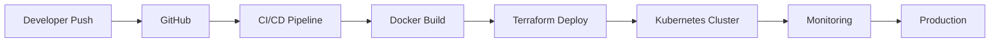

<div align="center">

# ⚡ AKSHAY KUMAR SINGH ⚡

### ☁️ AZURE DEVOPS ENGINEER • AI CLOUD AUTOMATION


<br>


<br><br>


</div>

---

# 🤖 ABOUT ME

```yaml
name: Akshay Kumar Singh
github: skakshay11
role: Azure DevOps Engineer

experience: 4.5+ Years

specialization:
  - Azure DevOps
  - Kubernetes
  - Terraform
  - Docker
  - Cloud Infrastructure
  - CI/CD Automation
````

---

# ⚡ TECH STACK

<div align="center">


</div>

---

# ☁️ DEVOPS WORKFLOW



---

# 📊 GITHUB ANALYTICS

<div align="center">


<br><br>


</div>

---

# 🏆 ACHIEVEMENTS

<div align="center">


</div>

---

# 📈 CONTRIBUTION GRAPH

<div align="center">


</div>

---

# 🚀 CURRENT FOCUS

```diff
+ Azure DevOps Automation
+ Kubernetes Infrastructure
+ Terraform Provisioning
+ Cloud Native Systems
+ Monitoring & Observability
```

---

# 🌐 CONNECT WITH ME

<div align="center">

<a href="https://github.com/skakshay11">

</a>

<a href="https://linkedin.com">

</a>

</div>

---

<div align="center">


# ⚡ AI • CLOUD • DEVOPS • AUTOMATION ⚡

### 🚀 BUILDING THE FUTURE OF INFRASTRUCTURE 🚀

</div>
```
